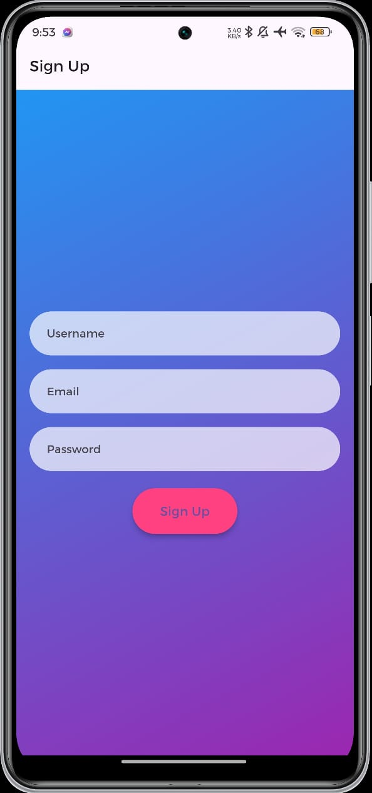
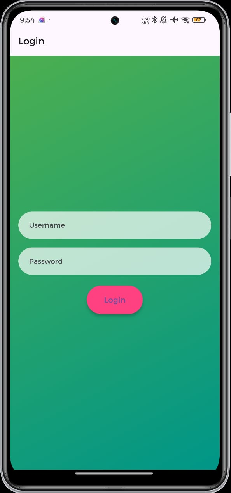
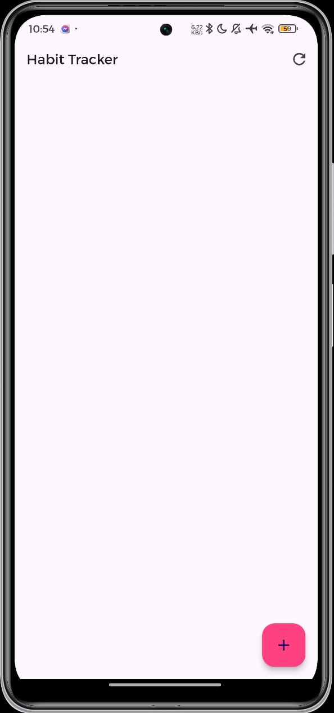
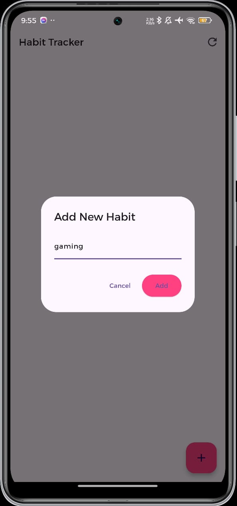
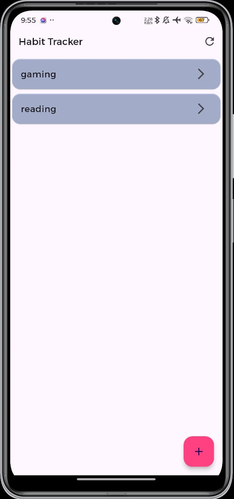
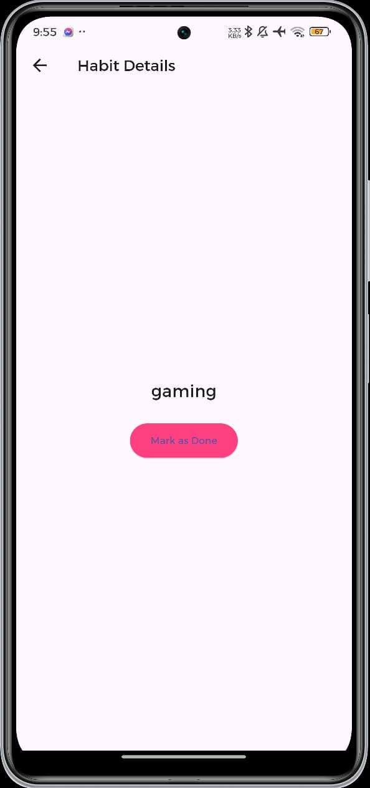
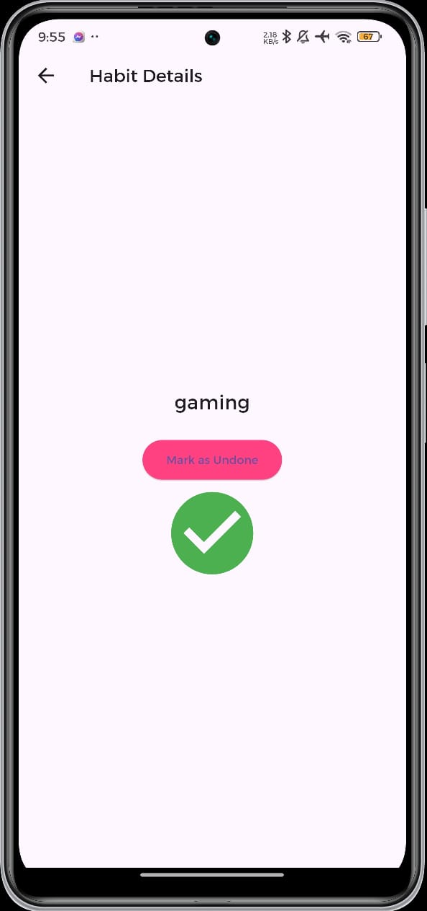

# 📱 Habit Tracker App

A simple Flutter-based mobile application designed to help users track and manage their daily habits efficiently. The app allows users to sign up, log in, add habits, view their progress, and mark habits as done or undone.

---

## 🧠 Overview

The **Habit Tracker App** helps users build consistency in their daily routines by letting them record, monitor, and evaluate habits in a minimal and user-friendly interface. It offers a smooth navigation flow, vibrant UI with gradient backgrounds, and persistent data storage for basic user authentication.

---

## 🎯 Objectives

- **User Management:** Secure registration and login for users.  
- **Habit Tracking:** Add, view, and mark habits as completed or uncompleted.  
- **Data Persistence:** Store user and habit data locally in JSON format.  
- **Modern UI:** Gradient backgrounds, rounded forms, and responsive layout.  

---

## ✨ Key Features

- 🔐 **User Signup & Login:** Secure credential-based authentication.  
- ✅ **Add & Manage Habits:** Create new habits and view them in a clean list view.  
- 🧾 **Track Progress:** Open habits and mark them as done or undone.  
- 💾 **Local JSON Storage:** Saves data without the need for external databases.  
- 🎨 **Attractive UI:** Gradient themes, rounded corners, and smooth transitions.  

---

## 📸 Screenshots

All screenshots are stored in the `Screenshots` folder in this repository.

<table style="width:100%; table-layout:fixed;">
  <thead>
    <tr>
      <th style="width:20%; text-align:left;">Screen</th>
      <th style="width:40%; text-align:left;">Description</th>
      <th style="width:40%; text-align:center;">Preview</th>
    </tr>
  </thead>
  <tbody>
    <tr>
      <td><b>1. Sign Up</b></td>
      <td>User registration screen</td>
      <td align="center"></td>
    </tr>
    <tr>
      <td><b>2. Login</b></td>
      <td>User login form with credentials validation</td>
      <td align="center"></td>
    </tr>
    <tr>
      <td><b>3. Home Screen</b></td>
      <td>Displays added habits and refresh button</td>
      <td align="center"></td>
    </tr>
    <tr>
      <td><b>4. Add New Habit</b></td>
      <td>Dialog to create a new habit</td>
      <td align="center"></td>
    </tr>
    <tr>
      <td><b>5. Added Habits</b></td>
      <td>List of all habits displayed on home screen</td>
      <td align="center"></td>
    </tr>
    <tr>
      <td><b>6. Habit Details</b></td>
      <td>Opens a specific habit with details</td>
      <td align="center"></td>
    </tr>
    <tr>
      <td><b>7. Mark as Done/Undone</b></td>
      <td>Allows user to toggle habit status</td>
      <td align="center"></td>
    </tr>
  </tbody>
</table>


---

## 🏗️ Project Structure

```

lib/
│
├── main.dart
├── signup_screen.dart
├── login_screen.dart
├── home_screen.dart
├── add_habit_screen.dart
├── habit_details_screen.dart
└── data_storage.dart

````

---

## ⚙️ Implementation Details

### **Frontend**

Built using **Flutter**, this project utilizes the following UI components:

- `Scaffold` for screen layout  
- `AppBar` for navigation and titles  
- `ListView` for scrollable habit lists  
- `TextField` for form input  
- `ElevatedButton` for user actions  

---

### **Shallow Widget Tree Overview**

#### **Home Screen**
- Scaffold → AppBar → ListView (Habits) → FloatingActionButton (+ Add Habit)

#### **Add Habit Dialog**
- AlertDialog → TextField (Habit Name) → Buttons (Cancel / Add)

#### **Habit Details**
- Scaffold → Column → Text (Habit Name) → Button (Mark as Done/Undone)

#### **Signup Screen**
- Scaffold → TextFields (Username, Email, Password) → Button (Sign Up)

#### **Login Screen**
- Scaffold → TextFields (Username, Password) → Button (Login)

---

## 💾 Data Storage Logic

### **Backend Logic**
User credentials and habit data are stored locally using **JSON files**.

#### Data Saving Example
```dart
static Future<void> saveUserData(String username, String password) async {
  _userData[username] = password;
}
````

#### Login Validation Example

```dart
static bool validateUser(String username, String password) {
  return _userData[username] == password;
}
```

This ensures user persistence across sessions without a dedicated backend or database.

---

## 🚀 Getting Started

### **Prerequisites**

* Install [Flutter SDK](https://flutter.dev/docs/get-started/install)
* Install [Android Studio](https://developer.android.com/studio)
* Configure device or emulator for testing

### **Steps to Run**

1. Clone this repository:

   ```bash
   git clone https://github.com/theikram/Habit-Tracker-Android-App-.git
   ```
2. Navigate to the project folder:

   ```bash
   cd Habit-Tracker-Android-App-
   ```
3. Get dependencies:

   ```bash
   flutter pub get
   ```
4. Run the app:

   ```bash
   flutter run
   ```

---

## 🔮 Future Enhancements

* Add push notifications for daily reminders
* Store data securely using SQLite or Firebase
* Track streaks and display progress statistics
* Add dark/light mode toggle

---

## 🏁 Conclusion

This project successfully implements a functional Habit Tracker app with user registration, login, habit management, and local storage. It demonstrates a clean Flutter architecture suitable for further enhancements and scalability.

